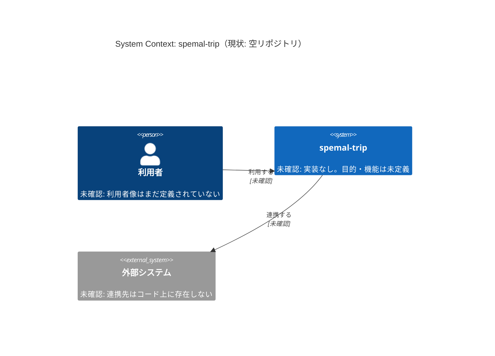

# spemal-trip

## アーキテクチャ概要

> 現時点でこのリポジトリにはアプリケーションのコードがありません。そのため、図の要素の多くは「未確認」です。
> 詳しくは [docs/architecture.md](docs/architecture.md) を参照してください。

```mermaid
C4Context
  title System Context: spemal-trip（現状: 空リポジトリ）
  Person(user, "利用者", "未確認: 利用者像はまだ定義されていない")
  System(spemal, "spemal-trip", "未確認: 実装なし。目的・機能は未定義")
  System_Ext(ext, "外部システム", "未確認: 連携先はコード上に存在しない")
  Rel(user, spemal, "利用する", "未確認")
  Rel(spemal, ext, "連携する", "未確認")
```
